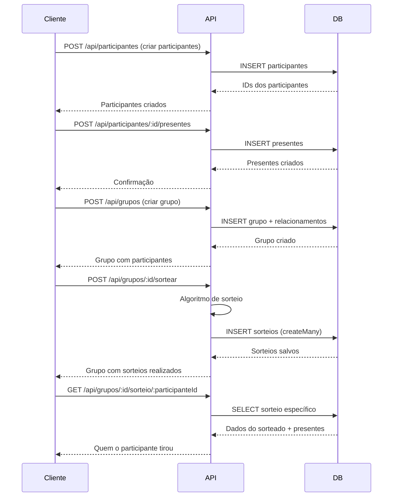

# 📚 Documentação Técnica - Sistema Amigo Oculto

## Sumário

1. [Arquitetura](#1-arquitetura)
2. [Tecnologias e Ferramentas](#2-tecnologias-e-ferramentas)
3. [Estrutura de Código](#3-estrutura-de-código)
4. [Modelos de Dados](#4-modelos-de-dados)
5. [Controllers](#5-controllers)
6. [Rotas](#6-rotas)
7. [Services](#7-services)
8. [Banco de Dados](#8-banco-de-dados)
9. [Fluxos de Negócio](#9-fluxos-de-negócio)
10. [Segurança](#10-segurança)
11. [Boas Práticas](#11-boas-práticas)

---

## 1. Arquitetura

### Padrão Arquitetural

O projeto segue o padrão **MVC (Model-View-Controller)** adaptado para APIs REST:

```
┌─────────────┐
│   Cliente   │
└──────┬──────┘
       │ HTTP Request
       ▼
┌─────────────┐
│   Routes    │ ──→ Define endpoints e métodos HTTP
└──────┬──────┘
       │
       ▼
┌─────────────┐
│ Controllers │ ──→ Processa requisições e retorna respostas
└──────┬──────┘
       │
       ▼
┌─────────────┐
│  Services   │ ──→ Lógica de negócio complexa
└──────┬──────┘
       │
       ▼
┌─────────────┐
│ Prisma ORM  │ ──→ Camada de acesso a dados
└──────┬──────┘
       │
       ▼
┌─────────────┐
│ PostgreSQL  │ ──→ Banco de dados
└─────────────┘
```

### Camadas da Aplicação

1. **Camada de Rotas** (`routes/`): Define os endpoints da API
2. **Camada de Controle** (`controllers/`): Manipula requisições HTTP
3. **Camada de Serviço** (`Services/`): Lógica de negócio
4. **Camada de Dados** (`config/database.ts` + Prisma): Acesso ao banco
5. **Camada de Modelo** (`models/`): Interfaces TypeScript

---

## 2. Tecnologias e Ferramentas

### Core

| Tecnologia | Versão | Propósito |
|------------|--------|-----------|
| Node.js | >= 18 | Runtime JavaScript |
| TypeScript | ^5.9.3 | Superset com tipagem |
| Express | ^4.18.0 | Framework web |
| Prisma | ^5.22.0 | ORM para PostgreSQL |
| PostgreSQL | >= 12 | Banco de dados relacional |

### Dependências Principais

```json
{
  "@prisma/client": "^5.22.0",      // Cliente Prisma
  "express": "^4.18.0",              // Framework web
  "bcryptjs": "^2.4.3",              // Hash de senhas
  "jsonwebtoken": "^9.0.0",          // Autenticação JWT
  "cors": "^2.8.5",                  // Cross-Origin Resource Sharing
  "helmet": "^7.0.0",                // Segurança HTTP
  "joi": "^17.9.0",                  // Validação de dados
  "uuid": "^13.0.0",                 // Geração de UUIDs
  "dotenv": "^16.6.1"                // Variáveis de ambiente
}
```

### DevDependencies

```json
{
  "@types/express": "^4.17.0",
  "@types/node": "^20.19.25",
  "ts-node-dev": "^2.0.0",           // Hot reload
  "typescript": "^5.9.3"
}
```

---

## 3. Estrutura de Código

### Organização de Diretórios

```
src/
├── config/              # Configurações da aplicação
│   └── database.ts      # Instância do Prisma Client
│
├── controllers/         # Controladores das rotas
│   ├── GrupoController.ts
│   ├── ParticipanteController.ts
│   ├── PresenteController.ts
│   ├── SorteioController.ts
│   └── UsuarioController.ts
│
├── models/              # Interfaces TypeScript
│   ├── GrupoSorteio.ts
│   ├── Participante.ts
│   ├── Presente.ts
│   ├── Sorteio.ts
│   └── Usuario.ts
│
├── routes/              # Definição de rotas
│   ├── grupoRoutes.ts
│   ├── participanteRoutes.ts
│   ├── presenteRoutes.ts
│   ├── sorteioRoutes.ts
│   └── usuarioRoutes.ts
│
├── Services/            # Lógica de negócio
│   └── AlocacaoService.ts
│
├── index.ts             # Configuração do Express
└── server.ts            # Inicialização do servidor
```

### Arquivo Principal - `index.ts`

```typescript
import express from 'express';
import usuarioRoutes from './routes/usuarioRoutes';
import participanteRoutes from './routes/participanteRoutes';
import presenteRoutes from './routes/presenteRoutes';
import sorteioRoutes from './routes/sorteioRoutes';
import grupoRoutes from './routes/grupoRoutes';

const app = express();

app.use(express.json());

// Registro de rotas
app.use('/api/usuarios', usuarioRoutes);
app.use('/api/participantes', participanteRoutes);
app.use('/api/presentes', presenteRoutes);
app.use('/api/sorteios', sorteioRoutes);
app.use('/api/grupos', grupoRoutes);

// Health check
app.get('/health', (req, res) => {
  res.status(200).json({ status: 'OK', message: 'Server is running' });
});

export default app;
```

### Configuração do Servidor - `server.ts`

```typescript
import app from './index';

const PORT = process.env.PORT || 4000;

app.listen(PORT, () => {
  console.log(`Servidor rodando na porta ${PORT}`);
});
```

---

## 4. Modelos de Dados

### Schema Prisma

O schema completo está em `prisma/schema.prisma`:

#### Usuario

```prisma
model Usuario {
  id    Int    @id @default(autoincrement())
  nome  String
  senha String

  @@map("usuarios")
}
```

**Propósito**: Sistema de autenticação básico (futura implementação completa)

#### Participante

```prisma
model Participante {
  id               String   @id @default(dbgenerated("gen_random_uuid()")) @db.Uuid
  nome             String
  senha            String?
  description      String?
  evento           String
  created          DateTime @default(now())
  updated          DateTime @updatedAt
  
  // Relacionamentos
  presentes        Presente[]
  sorteiosFeitos   Sorteio[] @relation("ParticipanteSorteador")
  sorteiosRecebidos Sorteio[] @relation("ParticipanteSorteado")
  grupos           GrupoParticipante[]

  @@map("participantes")
}
```

**Campos**:
- `id`: UUID gerado automaticamente
- `nome`: Nome do participante
- `senha`: Senha opcional para acesso
- `description`: Descrição ou preferências
- `evento`: Nome do evento (ex: "Natal 2024")
- `created/updated`: Timestamps automáticos

**Relacionamentos**:
- 1:N com `Presente`
- 1:N com `Sorteio` (bidirecionalmente)
- N:M com `GrupoSorteio`

#### GrupoSorteio

```prisma
model GrupoSorteio {
  id            String   @id @default(dbgenerated("gen_random_uuid()")) @db.Uuid
  nome          String
  created       DateTime @default(now())
  updated       DateTime @updatedAt
  
  participantes GrupoParticipante[]
  sorteios      Sorteio[]

  @@map("grupos_sorteio")
}
```

**Propósito**: Agrupa participantes para realizar sorteios independentes

#### GrupoParticipante

```prisma
model GrupoParticipante {
  id              String        @id @default(dbgenerated("gen_random_uuid()")) @db.Uuid
  grupoId         String        @db.Uuid
  participanteId  String        @db.Uuid
  
  grupo           GrupoSorteio  @relation(fields: [grupoId], references: [id], onDelete: Cascade)
  participante    Participante  @relation(fields: [participanteId], references: [id], onDelete: Cascade)
  
  @@unique([grupoId, participanteId])
  @@map("grupos_participantes")
}
```

**Propósito**: Tabela de junção para relacionamento N:M entre grupos e participantes

#### Presente

```prisma
model Presente {
  id               String   @id @default(dbgenerated("gen_random_uuid()")) @db.Uuid
  nome             String
  descricao        String?
  imagem           String?
  participanteId   String   @db.Uuid
  
  participante     Participante @relation(fields: [participanteId], references: [id], onDelete: Cascade)

  @@map("presentes")
}
```

**Propósito**: Lista de desejos de cada participante

#### Sorteio

```prisma
model Sorteio {
  id                        String        @id @default(dbgenerated("gen_random_uuid()")) @db.Uuid
  grupoId                   String        @db.Uuid
  participanteId            String        @db.Uuid
  participanteSorteadoId    String        @db.Uuid
  created                   DateTime      @default(now())
  
  grupo                     GrupoSorteio  @relation(fields: [grupoId], references: [id], onDelete: Cascade)
  participante              Participante  @relation("ParticipanteSorteador", fields: [participanteId], references: [id], onDelete: Cascade)
  participanteSorteado      Participante  @relation("ParticipanteSorteado", fields: [participanteSorteadoId], references: [id], onDelete: Cascade)
  
  @@unique([grupoId, participanteId])
  @@map("sorteios")
}
```

**Propósito**: Registra os resultados dos sorteios
**Constraint**: Um participante só pode ter um sorteio por grupo

---

## 5. Controllers

### Padrão de Controller

Todos os controllers seguem a estrutura:

```typescript
import { Request, Response } from 'express';
import { prisma } from '../config/database';

export class NomeController {
  static async metodo(req: Request, res: Response): Promise<Response> {
    try {
      // Lógica do método
      return res.json(resultado);
    } catch (error) {
      return res.status(500).json({ message: 'Mensagem de erro', error });
    }
  }
}
```

### GrupoController

**Métodos principais**:

#### `getAll()`
```typescript
// GET /api/grupos
// Lista todos os grupos com participantes e sorteios
```

#### `getById(id)`
```typescript
// GET /api/grupos/:id
// Busca grupo específico com todos os relacionamentos
```

#### `create()`
```typescript
// POST /api/grupos
// Body: { nome: string, participantesIds: string[] }
// Cria grupo e adiciona participantes automaticamente
```

#### `realizarSorteio(id)`
```typescript
// POST /api/grupos/:id/sortear
// Algoritmo:
// 1. Valida se já houve sorteio
// 2. Valida mínimo de 2 participantes
// 3. Embaralha participantes
// 4. Verifica se ninguém tirou a si mesmo
// 5. Tenta até 100 vezes até encontrar combinação válida
// 6. Salva sorteios no banco
```

**Algoritmo de Sorteio**:

```typescript
const sorteados = [...participantes];
let sorteioValido = false;
let tentativas = 0;
const maxTentativas = 100;

while (!sorteioValido && tentativas < maxTentativas) {
  // Fisher-Yates shuffle
  for (let i = sorteados.length - 1; i > 0; i--) {
    const j = Math.floor(Math.random() * (i + 1));
    [sorteados[i], sorteados[j]] = [sorteados[j], sorteados[i]];
  }

  // Valida que ninguém tirou a si mesmo
  sorteioValido = participantes.every(
    (p, index) => p.id !== sorteados[index].id
  );
  tentativas++;
}
```

#### `getSorteioParticipante(id, participanteId)`
```typescript
// GET /api/grupos/:id/sorteio/:participanteId
// Retorna quem o participante tirou (incluindo lista de presentes)
```

### ParticipanteController

**Métodos**:

- `getAll()`: Lista todos os participantes
- `getById(id)`: Busca participante com presentes e sorteios
- `create()`: Cria novo participante
- `update(id)`: Atualiza dados do participante
- `delete(id)`: Remove participante
- `addPresente(id)`: Adiciona presente à lista do participante

### PresenteController

CRUD básico para presentes:

- `getAll()`
- `getById(id)`
- `create()`
- `update(id)`
- `delete(id)`

### SorteioController

**Métodos**:

- `getAll()`: Lista todos os sorteios
- `getById(id)`: Busca sorteio específico
- `create()`: Cria sorteio manual
- `delete(id)`: Remove sorteio
- `getByGrupo(grupoId)`: Lista sorteios de um grupo

### UsuarioController

CRUD básico para usuários (sistema de autenticação básico)

---

## 6. Rotas

### Estrutura de Rota

```typescript
import { Router } from 'express';
import { NomeController } from '../controllers/NomeController';

const router = Router();

router.get('/', NomeController.metodo);
router.post('/', NomeController.metodo);
// ... outros métodos

export default router;
```

### Mapeamento Completo de Rotas

#### Grupos (`/api/grupos`)

```
GET    /                                      → getAll
GET    /:id                                   → getById
POST   /                                      → create
PUT    /:id                                   → update
DELETE /:id                                   → delete
POST   /:id/participantes                     → addParticipante
DELETE /:id/participantes/:participanteId    → removeParticipante
POST   /:id/sortear                           → realizarSorteio
GET    /:id/sorteio/:participanteId          → getSorteioParticipante
```

#### Participantes (`/api/participantes`)

```
GET    /                    → getAll
GET    /:id                 → getById
POST   /                    → create
PUT    /:id                 → update
DELETE /:id                 → delete
POST   /:id/presentes       → addPresente
```

#### Presentes (`/api/presentes`)

```
GET    /       → getAll
GET    /:id    → getById
POST   /       → create
PUT    /:id    → update
DELETE /:id    → delete
```

#### Sorteios (`/api/sorteios`)

```
GET    /                     → getAll
GET    /:id                  → getById
POST   /                     → create
DELETE /:id                  → delete
GET    /grupo/:grupoId       → getByGrupo
```

#### Usuários (`/api/usuarios`)

```
GET    /       → getAll
GET    /:id    → getById
POST   /       → create
PUT    /:id    → update
DELETE /:id    → delete
```

---

## 7. Services

### AlocacaoService

**Propósito**: Alocação de participantes em salas (para eventos grandes)

```typescript
export type SalaSorteio = {
  id: number;
  participantes: string[];
};

export function alocarGrupos(participantes: string[]): SalaSorteio[] {
  const salas: SalaSorteio[] = [];
  let salaId = 1;
  
  // Divide em grupos de no máximo 50 participantes
  for (let i = 0; i < participantes.length; i += 50) {
    const grupo = participantes.slice(i, i + 50);
    salas.push({
      id: salaId++,
      participantes: grupo,
    });
  }
  
  return salas;
}
```

**Uso futuro**: Pode ser expandido para eventos com muitos participantes, criando múltiplos grupos automaticamente.

---

## 8. Banco de Dados

### Configuração do Prisma

**`config/database.ts`**:

```typescript
import { PrismaClient } from '@prisma/client';

export const prisma = new PrismaClient();
```

**Instância única**: O Prisma Client é instanciado uma vez e exportado para uso em toda a aplicação.

### Migrações

#### Criar nova migração

```bash
npx prisma migrate dev --name nome_da_migracao
```

#### Aplicar migrações em produção

```bash
npx prisma migrate deploy
```

#### Resetar banco de dados (desenvolvimento)

```bash
npx prisma migrate reset
```

### Prisma Studio

Interface visual para gerenciar dados:

```bash
npx prisma studio
```

Abre em `http://localhost:5555`

### Queries Comuns com Prisma

#### Buscar com relacionamentos

```typescript
const participante = await prisma.participante.findUnique({
  where: { id },
  include: {
    presentes: true,
    grupos: {
      include: {
        grupo: true
      }
    }
  }
});
```

#### Criar com relacionamentos

```typescript
const grupo = await prisma.grupoSorteio.create({
  data: {
    nome: "Natal 2024",
    participantes: {
      create: [
        { participanteId: "uuid-1" },
        { participanteId: "uuid-2" }
      ]
    }
  }
});
```

#### Criar múltiplos registros

```typescript
await prisma.sorteio.createMany({
  data: sorteiosData
});
```

#### Deletar com cascade

```typescript
// Definido no schema com onDelete: Cascade
await prisma.grupoSorteio.delete({
  where: { id }
});
// Automaticamente deleta participantes e sorteios relacionados
```

---

## 9. Fluxos de Negócio

### Fluxo: Criar e Realizar Sorteio



### Fluxo: Consultar Sorteio

```
1. Participante acessa sistema
2. Informa grupo e sua identificação
3. Sistema retorna apenas quem ele tirou
4. Exibe lista de presentes do sorteado
```

### Regras de Negócio

#### Sorteio

1. ✅ Mínimo de 2 participantes por grupo
2. ✅ Ninguém pode sortear a si mesmo
3. ✅ Sorteio só pode ser realizado uma vez por grupo
4. ✅ Máximo de 100 tentativas para encontrar combinação válida
5. ✅ Participante só pode ver quem ele tirou (não vê outros sorteios)

#### Participantes

1. ✅ Podem estar em múltiplos grupos
2. ✅ Senha é opcional
3. ✅ Podem ter lista de presentes vazia

#### Grupos

1. ✅ Podem ter N participantes
2. ✅ Sorteio é único por grupo
3. ✅ Exclusão cascata: deleta sorteios e relacionamentos

---

## 10. Segurança

### Implementações Atuais

#### Headers HTTP Seguros (Helmet)

```typescript
import helmet from 'helmet';
app.use(helmet());
```

Protege contra:
- XSS (Cross-Site Scripting)
- Clickjacking
- MIME sniffing
- E outros ataques comuns

#### CORS

```typescript
import cors from 'cors';
app.use(cors());
```

Configurado para permitir requisições cross-origin.

#### Preparação para Autenticação

- `bcryptjs` instalado para hash de senhas
- `jsonwebtoken` instalado para JWT
- Estrutura de usuários criada

### Melhorias Recomendadas

#### 1. Implementar Autenticação JWT

```typescript
// middleware/auth.ts
import jwt from 'jsonwebtoken';

export const authenticate = (req, res, next) => {
  const token = req.headers.authorization?.split(' ')[1];
  
  if (!token) {
    return res.status(401).json({ message: 'Token não fornecido' });
  }
  
  try {
    const decoded = jwt.verify(token, process.env.JWT_SECRET!);
    req.user = decoded;
    next();
  } catch (error) {
    return res.status(401).json({ message: 'Token inválido' });
  }
};
```

#### 2. Validação de Dados (Joi)

```typescript
import Joi from 'joi';

const participanteSchema = Joi.object({
  nome: Joi.string().min(3).required(),
  senha: Joi.string().min(6),
  evento: Joi.string().required()
});

// No controller
const { error } = participanteSchema.validate(req.body);
if (error) {
  return res.status(400).json({ message: error.details[0].message });
}
```

#### 3. Rate Limiting

```typescript
import rateLimit from 'express-rate-limit';

const limiter = rateLimit({
  windowMs: 15 * 60 * 1000, // 15 minutos
  max: 100 // máximo 100 requisições
});

app.use('/api/', limiter);
```

#### 4. Variáveis de Ambiente Sensíveis

```env
DATABASE_URL=postgresql://...
JWT_SECRET=chave_secreta_aleatoria_muito_longa
PORT=4000
NODE_ENV=production
```

---

## 11. Boas Práticas

### Código TypeScript

#### ✅ Usar tipos explícitos

```typescript
async function create(req: Request, res: Response): Promise<Response> {
  // ...
}
```

#### ✅ Interfaces para dados complexos

```typescript
interface CreateGrupoDTO {
  nome: string;
  participantesIds: string[];
}
```

#### ✅ Try-catch em todos os controllers

```typescript
try {
  // lógica
} catch (error) {
  return res.status(500).json({ message: 'Erro', error });
}
```

### Prisma

#### ✅ Usar include para relacionamentos

```typescript
include: {
  participantes: {
    include: {
      participante: true
    }
  }
}
```

#### ✅ Usar select para limitar campos sensíveis

```typescript
participante: {
  select: {
    id: true,
    nome: true
    // Não incluir senha
  }
}
```

#### ✅ Usar transactions para operações múltiplas

```typescript
await prisma.$transaction([
  prisma.sorteio.deleteMany({ where: { grupoId } }),
  prisma.sorteio.createMany({ data: novos Sorteios })
]);
```

### Express

#### ✅ Middleware de erro centralizado

```typescript
app.use((err, req, res, next) => {
  console.error(err.stack);
  res.status(500).json({ message: 'Erro interno do servidor' });
});
```

#### ✅ Validação de parâmetros

```typescript
if (!req.params.id) {
  return res.status(400).json({ message: 'ID não fornecido' });
}
```

### Organização

#### ✅ Um controller por recurso
#### ✅ Um arquivo de rota por controller
#### ✅ Services para lógica complexa
#### ✅ Modelos como interfaces TypeScript

---

## 12. Testes

### Estrutura Recomendada

```
tests/
├── unit/
│   ├── controllers/
│   ├── services/
│   └── models/
├── integration/
│   └── api/
└── e2e/
```

### Exemplo de Teste com Jest

```typescript
import request from 'supertest';
import app from '../src/index';

describe('Participantes API', () => {
  it('deve criar participante', async () => {
    const response = await request(app)
      .post('/api/participantes')
      .send({
        nome: 'Test User',
        evento: 'Test Event'
      });
    
    expect(response.status).toBe(201);
    expect(response.body).toHaveProperty('id');
  });
});
```

---

## 13. Deploy

### Preparação para Produção

#### 1. Build

```bash
npm run build
```

Gera arquivos JavaScript em `dist/`

#### 2. Variáveis de Ambiente

```env
NODE_ENV=production
DATABASE_URL=postgresql://...
PORT=80
```

#### 3. Executar Migrações

```bash
npx prisma migrate deploy
```

#### 4. Iniciar Servidor

```bash
npm start
```

### Plataformas Recomendadas

- **Heroku**: Fácil deploy com PostgreSQL
- **Railway**: Deploy automático via Git
- **DigitalOcean**: Droplets com Docker
- **AWS**: EC2 + RDS
- **Render**: Deploy gratuito com PostgreSQL

### Docker (Exemplo)

```dockerfile
FROM node:18-alpine

WORKDIR /app

COPY package*.json ./
RUN npm ci --only=production

COPY . .
RUN npx prisma generate
RUN npm run build

EXPOSE 4000
CMD ["npm", "start"]
```

---

## 14. Manutenção

### Logs

Implementar sistema de logs:

```typescript
import winston from 'winston';

const logger = winston.createLogger({
  level: 'info',
  format: winston.format.json(),
  transports: [
    new winston.transports.File({ filename: 'error.log', level: 'error' }),
    new winston.transports.File({ filename: 'combined.log' })
  ]
});
```

### Monitoramento

- **Sentry**: Para tracking de erros
- **PM2**: Para gerenciamento de processos Node.js
- **New Relic**: Para performance monitoring

### Backup

```bash
# Backup do PostgreSQL
pg_dump -U usuario -d amigo_oculto > backup.sql

# Restore
psql -U usuario -d amigo_oculto < backup.sql
```

---

## 15. Próximos Passos

### Features Planejadas

- [ ] Sistema completo de autenticação JWT
- [ ] Frontend React/Next.js
- [ ] Notificações por email
- [ ] Upload de imagens para presentes
- [ ] Chat entre participantes
- [ ] Histórico de eventos passados
- [ ] Dashboard administrativo
- [ ] Testes automatizados
- [ ] API documentation (Swagger)
- [ ] Websockets para atualizações em tempo real

### Melhorias Técnicas

- [ ] Implementar cache (Redis)
- [ ] Adicionar testes unitários e integração
- [ ] Documentação OpenAPI/Swagger
- [ ] CI/CD pipeline
- [ ] Docker Compose para desenvolvimento
- [ ] Validação de dados mais robusta
- [ ] Paginação em listagens
- [ ] Filtros e buscas avançadas
- [ ] Soft delete para dados históricos

---

## 📞 Suporte

Para dúvidas técnicas ou contribuições, consulte:

1. Documentação do Prisma: https://www.prisma.io/docs
2. Documentação do Express: https://expressjs.com
3. TypeScript Handbook: https://www.typescriptlang.org/docs

---

**Última atualização**: Dezembro 2024  
**Versão**: 1.0.0
